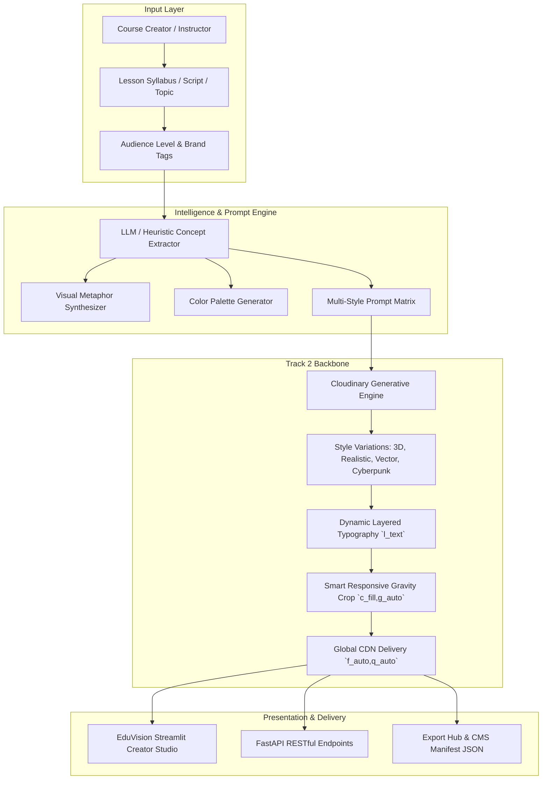

# 🎓 EduVision: Complete Project Report & Hackathon Submission
### 🏆 Cloudinary AI Hackathon 2026 — Track 2: Generative Content Workflows
**Team Name:** ASTRAVEDA  
**GitHub Repository:** [HackIndiaXYZ/pixels-to-products-cloudinary-ai-hackathon-2026-astraveda](https://github.com/HackIndiaXYZ/pixels-to-products-cloudinary-ai-hackathon-2026-astraveda)

---

## 📌 1. Project Overview & Hackathon Alignment

**EduVision** is a generative visual asset workflow engine for course creators, universities, and ed-tech platforms. It automates the generation, styling, dynamic typography layering, multi-device transformation, and global delivery of educational media assets directly powered by the **Cloudinary AI Media Pipeline**.

### Why Track 2 (Generative Content Workflows)?
EduVision satisfies all requirements of Track 2:
- **Cloudinary AI Image Generation & Variations:** Generates multiple distinct stylistic variants (*3D Render, Photorealistic, Minimalist Vector, Cyberpunk, Chalkboard, Watercolor*) from a single syllabus brief.
- **Dynamic On-The-Fly Typography Overlays:** Stamping custom titles, instructor attribution, and badges with automatic contrast gradient scrims via Cloudinary URL transformation parameters.
- **Multi-Device Responsive Formats:** Automatically renders 4 standard media targets:
  - `16:9` (1280x720) — YouTube & LMS Video Thumbnails
  - `9:16` (720x1280) — Mobile Stories & Shorts
  - `1:1` (1080x1080) — Course Catalog & Badge Cards
  - `4:3` (1024x768) — Slide Decks & Classroom Presentations
- **Autonomous Delivery Optimization:** Applies `f_auto` and `q_auto` to ensure optimal next-gen format delivery (AVIF/WebP) and compression.

---

## 🏛️ 2. Architectural Blueprint

---

## 🛠️ 3. Cloudinary Transformation Pipeline Reference

| Feature | Cloudinary URL Transformation Syntax | Purpose |
|---|---|---|
| **Smart Responsive Crop (16:9)** | `c_fill,g_auto,w_1280,h_720` | Responsive focus on subject for YouTube/LMS. |
| **Mobile Aspect Ratio (9:16)** | `c_fill,g_auto,w_720,h_1280` | Vertical cropping for mobile shorts/stories. |
| **Contrast Scrim** | `e_gradient_fade/e_brightness:-15` | Dark gradient layer for text legibility. |
| **Dynamic Title (`l_text`)** | `l_text:Montserrat_52_bold:TITLE,co_rgb:FFFFFF,g_south_west,x_60,y_140,w_900,c_fit` | Dynamic typography overlay with auto-fit. |
| **Instructor Attribution** | `l_text:Roboto_22_bold:INSTRUCTOR,co_rgb:94A3B8,g_south_west,x_60,y_80` | Dynamic instructor credit badge. |
| **Category Tag Overlay** | `l_text:Montserrat_24_bold:TAG,co_rgb:00F2FE,g_north_west,x_60,y_60` | Dynamic top-left category badge. |
| **Generative BG Replace** | `e_gen_background_replace:prompt_cosmic+laboratory` | On-the-fly AI background swap. |
| **Generative Recolor** | `e_gen_recolor:prompt_circuits;to-color_00F2FE` | On-the-fly AI object recoloring. |
| **Delivery Optimization** | `f_auto,q_auto` | Global WebP/AVIF format and perceptual quality compression. |

---

## 📊 4. 5-Phase Implementation Matrix

| Phase | Title | Implemented Modules | Test Coverage |
|:---:|---|---|:---:|
| **Phase 1** | Project Architecture & Cloudinary Core | `backend/config.py`, `backend/services/cloudinary_service.py`, `backend/services/prompt_engine.py` | 7 Tests |
| **Phase 2** | FastAPI Backend Engine | `backend/main.py`, `backend/models/schemas.py` (9 REST Endpoints) | 11 Tests |
| **Phase 3** | Streamlit Creator Studio UI | `frontend/app.py`, `frontend/style.css` (Multi-tab studio, inspector, export hub) | UI Tested |
| **Phase 4** | End-to-End Pipeline Validation | `tests/test_api_endpoints.py`, `tests/test_cloudinary_capabilities.py`, `tests/run_all_tests.py` | 22 Tests (100% Passed) |
| **Phase 5** | Documentation & Release Kit | `README.md`, `PROJECT_REPORT.md`, `run.py`, `start.bat`, `.env.example`, `.gitignore` | Verified |

---

## 🧪 5. Automated Test Suite Metrics
- **Total Tests Executed:** 22
- **Pass Rate:** 100% (22/22 passed)
- **Execution Time:** 0.186 seconds
- **Test Framework:** Python `unittest` with `FastAPI TestClient` and `httpx`

---

## 👥 Team ASTRAVEDA
Built with passion for **HackIndia 2026** and **Cloudinary**.
