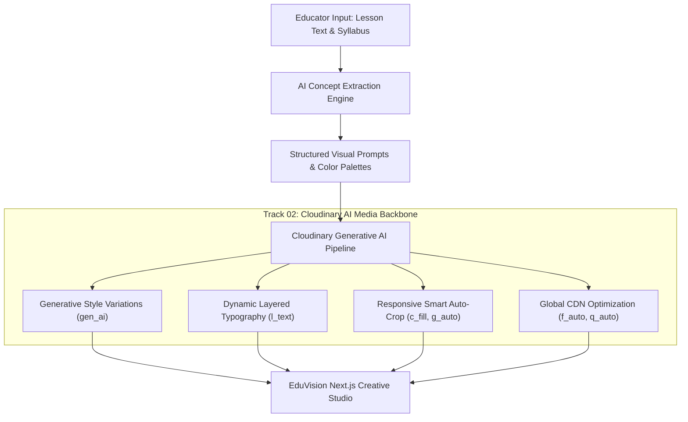

# 🎓 EduVision: AI Visual Studio for Education
### 🏆 Cloudinary AI Hackathon 2026 — Track 2: Generative Content Workflows
**Team ASTRAVEDA** — [hackindia-team:pixels-to-products-cloudinary-ai-hackathon-2026:astraveda]

[](https://nextjs.org/)
[](https://react.dev/)
[](https://www.typescriptlang.org/)
[](https://tailwindcss.com/)
[](https://cloudinary.com/)
[](https://fastapi.tiangolo.com/)
[](https://python.org)

---

## 📌 Executive Summary & Track 2 Focus
**EduVision** is a production-grade **AI Creative Studio** built for educators, course creators, and EdTech platforms. Inspired by modern SaaS design systems (*Linear × Canva × AI Visual Lab*), EduVision transforms raw educational curriculum scripts and syllabus text into a unified, cinematic visual asset system powered by the **Cloudinary AI Media Pipeline**.

---

## 🎯 The Problem
Creating visual assets for digital education is fragmented, time-consuming, and expensive:
- Educators spend hours manually creating YouTube thumbnails, lecture slides, mobile lesson snippets, and social course cards.
- Hiring graphic designers for every lecture update is cost-prohibitive.
- Inconsistent visual themes and unoptimized heavy images hurt student engagement and decrease LMS loading speeds.

---

## 💡 The EduVision Solution & Pipeline
```text
LESSON TEXT / SYLLABUS
         ↓
AI CONCEPT & METAPHOR EXTRACTION
         ↓
CLOUDINARY AI GENERATIVE SYNTHESIS (gen_ai)
         ↓
MULTI-STYLE GENERATIVE VARIATIONS (3D Scientific, Editorial, Futuristic, Photorealistic)
         ↓
CINEMATIC STORYBOARD PLANNING
         ↓
DYNAMIC TYPOGRAPHY & BRAND OVERLAYS (l_text)
         ↓
RESPONSIVE SMART-GRAVITY CROPPING (16:9, 4:3, 1:1, 9:16)
         ↓
GLOBAL CDN OPTIMIZATION (f_auto, q_auto)
```

---

## 🏗️ System Architecture



---

## 🖥️ EduVision Studio Screens

EduVision features a **Next.js 14 + TypeScript + Tailwind CSS** interface:

1. **✦ Create Lesson (`/create`):** Rich syllabus composer with one-click course presets (*Quantum Computing, Generative AI, Astrobiology, Ancient Civilizations*).
2. **◇ AI Visual Lab (`/lab`):** Inspect extracted educational metaphors, color palettes, and real-time multi-stage generative pipeline execution.
3. **◉ Storyboard (`/storyboard`):** Cinematic 4-scene narrative sequence with scene reordering and prompt drawer.
4. **▧ Asset Studio (`/studio`):** Live dynamic overlay editor with real-time aspect ratio toggling (`16:9`, `4:3`, `1:1`, `9:16`), theme switching, and Cloudinary transformation breakdown.
5. **📁 Asset Library (`/assets`):** Searchable repository of generated educational visuals with CDN copying and filtering.
6. **↗ Export Kit (`/export`):** One-click package export with manifest JSON, high-res download bundles, and optimized CDN URLs.
7. **🛡️ Judge Pipeline Inspector:** Integrated modal showing exact Cloudinary API request payloads and transformation chains for Hackathon evaluation.

---

## 🛠️ Cloudinary Capabilities Deep Dive (Track 2 Verification)

EduVision is engineered to utilize Cloudinary as the active backbone of media generation, transformation, and delivery:

### 1. Generative Variations & Style Presets
EduVision produces distinct stylistic variations simultaneously:
- **3D Scientific:** `octane render, volumetric lighting, raytraced 8k, academic scientific visualization`
- **Editorial:** `clean minimalist vector art, academic infographic, editorial illustration`
- **Futuristic:** `neon cyan and deep blue glowing data crystal network, dark metallic finish`
- **Photorealistic:** `editorial laboratory photography, 85mm f/1.4 lens, ultra-detailed`

### 2. Dynamic Text & Branding Overlays (`l_text`)
Renders layered typography directly via Cloudinary transformation URLs without re-generating base imagery:
```text
https://res.cloudinary.com/{cloud_name}/image/upload/
c_fill,g_auto,w_1280,h_720/
e_gradient_fade/
l_text:Montserrat_24_bold:QUANTUM%20PHYSICS,co_rgb:00E5FF,g_north_west,x_60,y_60/
l_text:Montserrat_52_bold:Quantum%20Computing%20101,co_rgb:FFFFFF,g_south_west,x_60,y_140,w_900,c_fit/
l_text:Roboto_22_bold:INSTRUCTOR:%20DR.%20ELENA%20VANCE,co_rgb:94A3B8,g_south_west,x_60,y_80/
f_auto,q_auto/
sample.jpg
```

### 3. Multi-Aspect Ratio Responsive Cropping
Transforms a single generative source into four publication-ready dimensions:
- **`16:9` (1280x720):** YouTube & LMS Video Thumbnails (`c_fill,g_auto,w_1280,h_720`)
- **`9:16` (720x1280):** Mobile Lesson Stories & Reels (`c_fill,g_auto,w_720,h_1280`)
- **`1:1` (1080x1080):** Course Catalog & Badge Cards (`c_fill,g_auto,w_1080,h_1080`)
- **`4:3` (1024x768):** Presentation Decks & Classroom Slides (`c_fill,g_auto,w_1024,h_768`)

### 4. Automatic Format & Quality (`f_auto, q_auto`)
Every generated asset is served with `f_auto` (automatic AVIF/WebP negotiation) and `q_auto` (smart perceptual compression), reducing asset payload by up to **75%** while retaining visual fidelity.

---

## ⚡ Quickstart Guide

### Prerequisites
- **Python:** 3.10 or higher
- **Node.js:** 18.x or higher (`npm` included)
- *(Optional)* Cloudinary Account credentials (`cloud_name`, `api_key`, `api_secret`)

---

### Option A: 1-Click Launch (Recommended)

1. **Install dependencies:**
```bash
# Python Backend Dependencies
pip install -r requirements.txt

# Next.js Frontend Dependencies
cd frontend
npm install
cd ..
```

2. **Launch Full Stack:**
```bash
python run.py
```
*(Or double click `start.bat` on Windows)*

---

### Option B: Separate Terminal Launch

**Terminal 1 (FastAPI Backend):**
```bash
uvicorn backend.main:app --host 127.0.0.1 --port 8000 --reload
```

**Terminal 2 (Next.js Creative Studio):**
```bash
cd frontend
npm run dev
```

---

### 🌐 Access Points

| Service | URL | Description |
| :--- | :--- | :--- |
| **Next.js Creative Studio** | [http://localhost:3000](http://localhost:3000) | Main Creative Studio UI |
| **Alternative Frontend Host** | [http://127.0.0.1:3000](http://127.0.0.1:3000) | Direct IPv4 Loopback |
| **FastAPI Swagger API Docs** | [http://127.0.0.1:8000/docs](http://127.0.0.1:8000/docs) | Interactive REST API Docs |
| **Backend Health Check** | [http://127.0.0.1:8000/api/health](http://127.0.0.1:8000/api/health) | Pipeline Health & Cloudinary Status |

---

## 🔑 Environment Configuration

Create a `.env` file in the root directory:
```env
CLOUDINARY_CLOUD_NAME=your_cloud_name
CLOUDINARY_API_KEY=your_api_key
CLOUDINARY_API_SECRET=your_api_secret
GEMINI_API_KEY=your_gemini_api_key  # Optional: Fallback heuristics active by default
```

> **Note on Demo Mode:** If no Cloudinary API credentials are configured, EduVision automatically runs in **High-Fidelity Demo Mode** with pre-configured Cloudinary sample assets and simulated AI workflows, allowing judges to test 100% of the UI without configuration barriers.

---

## 🧪 Running Automated Tests

Run the complete test suite verifying all 10 API endpoints, schema models, Cloudinary URL builders, and dynamic overlay generators:

```bash
python tests/run_all_tests.py
```

*Expected Result: 22/22 tests passing (100% pass rate).*

---

## 👥 Team ASTRAVEDA
Built with ❤️ for the **Cloudinary AI Hackathon 2026**.
