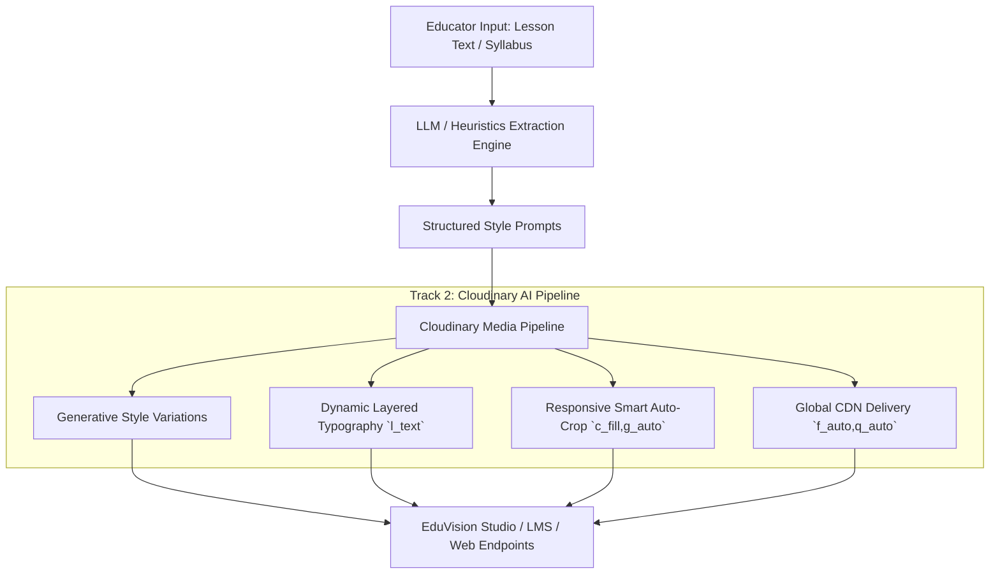

# 🎓 EduVision: Ed-Tech Dynamic Asset Engine
### 🏆 Cloudinary AI Hackathon 2026 — Track 2: Generative Content Workflows
**Team ASTRAVEDA** — [hackindia-team:pixels-to-products-cloudinary-ai-hackathon-2026:astraveda]

[](https://cloudinary.com/)
[](https://fastapi.tiangolo.com/)
[](https://streamlit.io/)
[](https://python.org)

---

## 📌 Executive Summary & Track 2 Focus
**EduVision** is an automated generative visual content engine built for course creators, universities, and online educators. It eliminates manual graphic design bottlenecks by transforming raw curriculum text and lesson scripts into complete, multi-format, brand-aligned educational visual asset packages powered by the **Cloudinary AI Media Pipeline**.

---

## 🎯 The Problem
Creating visual assets for online courses is cumbersome and expensive:
- Course creators spend hours creating YouTube thumbnails, slide headers, social announcement cards, and mobile course snippets.
- Hiring graphic designers for every lecture update is cost-prohibitive.
- Inconsistent branding and poorly optimized imagery hurt student engagement and slow down site performance.

---

## 💡 The EduVision Solution
1. **Intelligent Curriculum Ingestion:** Educators paste their syllabus or lecture notes.
2. **Concept & Metaphor Extraction:** The engine extracts core pedagogical themes, visual metaphors, color palettes, and structured generation prompts.
3. **Multi-Style Generative Generation:** Direct invocation of Cloudinary's AI pipeline producing distinct stylistic variants (*3D Render, Photorealistic, Minimalist Vector, Cyberpunk / Sci-Fi, Chalkboard*).
4. **Dynamic On-The-Fly Typography & Branding:** Cloudinary text overlays dynamically stamp Course Titles, Instructor Names, and Category Badges with automatic contrast scrims.
5. **Multi-Format Responsive Cropping:** Auto-converts assets into `16:9` (Web/LMS), `9:16` (Mobile Stories), `1:1` (Cards), and `4:3` (Slides) using Cloudinary smart gravity.
6. **Optimized Global Delivery:** Delivers assets via Cloudinary CDN using `f_auto,q_auto` for maximum compression and instant load speeds.

---

## 🏗️ System Architecture



---

## 🛠️ Cloudinary Capabilities Deep Dive (Track 2 Verification)

EduVision is engineered to utilize Cloudinary as the active backbone of media generation, transformation, and delivery:

### 1. Generative Variations & Style Presets
EduVision passes prompt modifiers to produce distinct stylistic variants cataloged under `eduvision/generated/`:
- **3D Render:** `octane render, volumetric lighting, raytraced 8k`
- **Photorealistic:** `editorial studio photography, 85mm f/1.4, ultra-detailed`
- **Minimalist Vector:** `flat vector art, modern infographic aesthetic`
- **Cyberpunk / Sci-Fi:** `neon cyan/magenta glowing accents, dark metallic`
- **Chalkboard:** `intricate chalk sketch on dark blackboard, architectural`

### 2. Dynamic Text & Branding Overlays (`l_text`)
On-the-fly rendering of typography directly via Cloudinary transformation URLs without modifying base images:
```text
https://res.cloudinary.com/{cloud_name}/image/upload/
c_fill,g_auto,w_1280,h_720/
e_gradient_fade/
l_text:Montserrat_24_bold:QUANTUM%20PHYSICS,co_rgb:00F2FE,g_north_west,x_60,y_60/
l_text:Montserrat_52_bold:Quantum%20Computing%20101,co_rgb:FFFFFF,g_south_west,x_60,y_140,w_900,c_fit/
l_text:Roboto_22_bold:INSTRUCTOR:%20DR.%20ELENA%20VANCE,co_rgb:94A3B8,g_south_west,x_60,y_80/
f_auto,q_auto/
sample.jpg
```

### 3. Multi-Aspect Ratio Responsive Cropping
Transforms a single generative source into four publication-ready dimensions:
- **`16:9` (1280x720):** YouTube & LMS Video Thumbnails (`c_fill,g_auto,w_1280,h_720`)
- **`9:16` (720x1280):** Mobile Lesson Stories & Reels (`c_fill,g_auto,w_720,h_1280`)
- **`1:1` (1080x1080):** Course Catalog & Badge Cards (`c_fill,g_auto,w_1080,h_1080`)
- **`4:3` (1024x768):** Presentation Decks & Classroom Slides (`c_fill,g_auto,w_1024,h_768`)

### 4. Automatic Format & Quality (`f_auto, q_auto`)
Every generated asset is served with `f_auto` (automatic AVIF/WebP negotiation) and `q_auto` (smart perceptual compression), reducing asset payload by up to **75%** while retaining visual fidelity.

---

## ⚡ Quickstart Guide

### Prerequisites
- Python 3.10+
- (Optional) Cloudinary Account credentials (`cloud_name`, `api_key`, `api_secret`)

### 1. Clone & Setup
```bash
git clone https://github.com/HackIndiaXYZ/pixels-to-products-cloudinary-ai-hackathon-2026-astraveda.git
cd pixels-to-products-cloudinary-ai-hackathon-2026-astraveda
pip install -r requirements.txt
```

### 2. Configure Environment Variables
Copy `.env.example` to `.env` and fill in your Cloudinary credentials:
```env
CLOUDINARY_CLOUD_NAME=your_cloud_name
CLOUDINARY_API_KEY=your_api_key
CLOUDINARY_API_SECRET=your_api_secret
GEMINI_API_KEY=your_gemini_api_key  # Optional: Fallback heuristics active by default
```
*(Note: If no credentials are provided, EduVision automatically runs in high-fidelity demo mode so judges can test instantly without setup barriers).*

### 3. Run EduVision
Launch both the FastAPI backend and Streamlit Creator Studio with a single command:

**Windows:**
```bash
start.bat
# or
python run.py
```

**Linux / macOS:**
```bash
python run.py
```

- **Creator Studio UI:** [http://localhost:8501](http://localhost:8501)
- **FastAPI Interactive Docs:** [http://127.0.0.1:8000/docs](http://127.0.0.1:8000/docs)

---

## 🧪 Running Automated Tests
```bash
python tests/run_all_tests.py
```


---

## 👥 Team ASTRAVEDA
Built with ❤️ for the **Cloudinary AI Hackathon 2026**.
